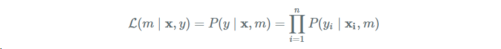

# Kernel Mixture Networks
### 1. [원문 링크 - https://janvdvegt.github.io/2017/06/07/Kernel-Mixture-Networks.html ](https://janvdvegt.github.io/2017/06/07/Kernel-Mixture-Networks.html)
### 2. [한국 관련 자료 - Kernel Density Estimation(커널밀도추정)에 대한 이해](http://darkpgmr.tistory.com/147)

---

## 서론
- 나는  기본 회귀 분석 모델이 내가 사용하기에 충분하기 않다고 생각한다. 
- 예측 모델 자체의 불확실성을 모델링 하는 것은 예측 모델 출력에 근거하여 결정이 이루어져야 하는 시나리오에 대한 많은 가치를 추가할 수 있다.
- 입력 시 조건에 따라 조건부 확률 분포를 예측함으로써(특정한 입력을 고려하여) 적절한 정보를 얻을 수 있다면 휠씬 더 많은 정보를 얻을 수 있다.
- 필요하다면 이 분포를 다시 평균으로 축소함으로 최대 확률 값을 추정할 수 있다.

- KMN의 일반적인 사용 사례
```
- 몬테카를로 표준 추출 (조건부 분포)

- 강화 학습에서 exploration - exploitation 딜레마

- Quantile regression without specifically training on one quantile - quantile regression 공부하기

- Reversed quantile information, estimation the probability that the output will be lower or higer than a non-predetermined y - quantile 공부하기

- 출력에 예상보다 많은 비선형 비용이 발생하는 많은 지식이 필요로 한 모델
```

- 우선 조건 밀도 추정에 대한 접근법을 살펴보고 조건부 밀도 추정에 대한 알아보자
- 다음으로, 커널 혼합 네트워크(Kernel Mixture Network ; 연속 무작위 변수의 조건부 밀도 추정을 위한 비모수적 방법)라는 새롭게 발표된 논물을 검토해 보자. 해당 저자는 새로운 문제를 해결하기 위해 새로운 조합을 사용하는 연속 무작위 변수의 조건부 밀도 추정을 위한 비모수적 방법을 검토
- Pyhton으로 구현가 향후 확대 연구를 고려함.


---
## Unconditional density estimation
-  unconditional density estimation에서 우리는 n차원에 있는 확률분호 p(x)에 관심이 있다.
- 이 섹션에서는 μ=0  σ=1(평균 0, 표준편자 1)인 1차원 가우시안에 의해 생성된 점 집합을 살펴보고, Conditional density estimation 기법을 적용하기 적에 샘플 사이즈가 증가함으로 어떻게 다른 예측이 영향을 받고, 각 방법의 단점이 무엇인지 알아보자.
---

## Histogram
- 히스토그램은 사전 정의된 각 범위에 속하는 관측 수를 계산하여 입력 차원을 불연속화한다.
- 표본 크기가 히스토그램에 미치는 영향은 아래와 같습니다.
   
 

- 위 애니메이션에서 보듯이 실제 분표에 가까워지려면 상당한 수의 샘플이 필요하다.
- 또한 데이터를 이산화했기 때문에 많은 양의 데이터를 사용하지 않고서는 절대로 실제 값에 가까이 접근 할 수 없다.
- 데이터 너비가 너무 작은면 데이터 수와 불일치가 늘어나고 너무 큰 넓이의 데이터는 세부 정보를 평균화하여 관련 정보를 난독화한다.
- 히스토그램의 이점은 데이터를 생성한 분포의 모양과 관련하여 가정을 거의하지 않으며 분배를 시각화하는 매우 직관적인 방법이다.
- 즉 빈의 너비를 올바르게 설정하는 것은 까다로운 일이다. 분포를 근사하는 것은 범위가 빈의 시작과 끝으로 묶여 있음을 뜻함. 빈의 경게 근처에 있는 점은 자기 자신의 구역보다 인접한 빈의 점에 더 가깝다.
- 히스토그램 확률 밀도는 다음가 같이 설명된다.


$$f(x) = \sum_{j=1}^k {\bold U}j(x)$$

${\bold U}j(x)$ 은 bin의 높이이다.
---

## Fitting parameterized distributions
- 히스토그램 또는 커널 밀도 추정과 같은 비모수적 접근법을 사용하는 대신 가정된 분표에 맞게 매개변수를 추정하는 파라메트릭 분포를 사용할 수 있다.
- 만약 분포가 데이터에 잘 맞는 경우 비교적 적은 양의 데이터로 매우 적합하지만 데이터와 마지 않으면 불량한 결과가 발생합니다.
- 예를 들어 가운시안과 같은 표준 분포는 데이터의 일부 통계를 보는 것만으로 쉽게 적합합니다.
- 가우시안 경우 평균과 표준편차는 당신의 데이터가 만들어낸 가장 적합한 가우시안을 생성한다.


- 가중을 통한 다른 분포를 결합을 통해 합리적으로 매개변수의 양을 유지하면서 분포영역으로 확장할 수 있다.
- 이러한 mixture 로 부터 샘플링을 쉽습니다.
- 먼저 우리가 실제로 샘플링한 하위 분포를 불연속 분포에서 샘플링합니다.
- 전체 밀도는 다음과 같이 정의됩니다.

$$f(x) = \sum_{j=1}^k {\pi}_j {f}_j (x)$$

- ${\pi}_j$ 은 하위분포 j의 가중치이다. ${\pi}_j >= 0$ and, $\sum_{j=1}^k {\pi}_j = 1$ 이다.

---
## Kernel density estimation
- 다른 비매개 변수 옵션은 커널 밀도 추정입니다. 핵심 개념은 데이터에 있는 모든 관찰이 전체 분포에서 작은 하위 분포에 기여한다는 것입니다.
- 우리는 커널을 사용하여 각 관측치 주위에 분포를 정의함으로써 이를 수행합니다. 커널은 실수가 아닌 함수이고, 비 파라메트릭 통게의 경우에는 1로 통합되고 대칭입니다.
- 이러한 커널은 일반적으로 한 공간에서 두 지점 사이의 유사성을 나타냅니다. 아이디어는 모든 관측치를 커널 중심으로 사용하는 것입니다. 왜냐하면은 이 점은 우리가 추정하고자하는 분포에 의해 생성되었다는 증거가 있기 때문입니다. 
- 우리가 선택할 수 있는 많은 종류의 커널이 있지만, 경험적으로 별로 중요하지는 않습니다. 히스토그램과 같이 모든 새로운 관측치가 엄격하게 양수이어야 합니다. 그렇지 않으면 그 지점을 관측할 수 없습니다.
- 보통 가우시안 커널이 사용되며, 다음과 같이 정의됩니다.


- 우리는 모든 관측값에 대해 이 커널을 정의을 정의하고 1/n 만큼 가중치를 부여합니다. 이는 가중치가 적용된 커널의 합게가 다시 1이 되는 것을 의미한다. 
- σ는 커널의 대역폭을 결정하는데, 분포의 형태에 크게 영향을 미친다. 양호한 대역폭 값을 계산하기 위한 몇 가지 발견적 방법이 있지만 로그 확률로 평가된 여러 대역폭의 교차 유효성 검사 절차가 좋다.
- 대역폭이 너무 적으면 매우 불안정한 분포를 생성하고 너무 크면 히스트그램과 유사하게 많은 뉘앙스를 읽게 된다. 여기서는 대역폭 크기가 배포본의 모양에 미치는 샘플크기를 확인 할 수 있다.


---
## Conditional density estimation
- 이전에는 밀도에 대한 전체 데이터 세트 X를 고려했습니다. 대신, 이제 우리는 대응하는 x가 주어졌을 때 y에 대한 확률 분포를 추정하는 경우에 대해 알아봅시다.
- 이 도델의 훈련과 평가는 대개 우리의 데이터 (x,y) 가 주어진 모델 m의 가능성을 포함합니다.
- 이것은 모델 m에 주어진 데이터의 밀도와 같습니다. 모든 관측을 보고 우리 모델과 해당 피쳐 x가 주어진 y에 대한 우리의 밀도 함수의 값을 계산하고, 각각의 밀도를 곱하면 우리는 다음과 같은 가능성에 도달하게 됩니다.



- 수치적 안정성을 위해 log likehood가 사용되어 log 함수의 합계로 바뀌어 log함수가 단조롭게 증가한다는 가정하에 최적화는 동일합니다. 관습적으로 손실 함수는 신경망으로 최소화됩니다. 즉 이를 무효로 하고 음의 대수 우도라고 할 수 있습니다.


- P(yi | xi,m)을 미분 가능하다면, 음의 대수 우도 또한 미분 가능합니다. 즉 이것을 우리가 선호하는 심층학습에 연결하고 모델을 직접 최적화 할 수 있다는 것을 의미합니다.
- 이 게시물의 나머지 부분에서 우리가 이야기할 출력 레이어는 신경망의 모든 정상 레이어 위에 쌓을 수 있습니다. 예를 들어, 정상적인 피드 포워드 네트워크의 상단에 있지만 RNN, CNN에서도 동일합니다.
---
## Quantized softmax networks
- Quantized softmax network를 사용하여 정규화된 막대 그래프에서 각 막대의 높이를 계산합니다. 출력 범위를 똑같은 크기의 출력함으로 각 출력을 균일한 밀도로 잘라서 추정을 수행할 수 있습니다.
